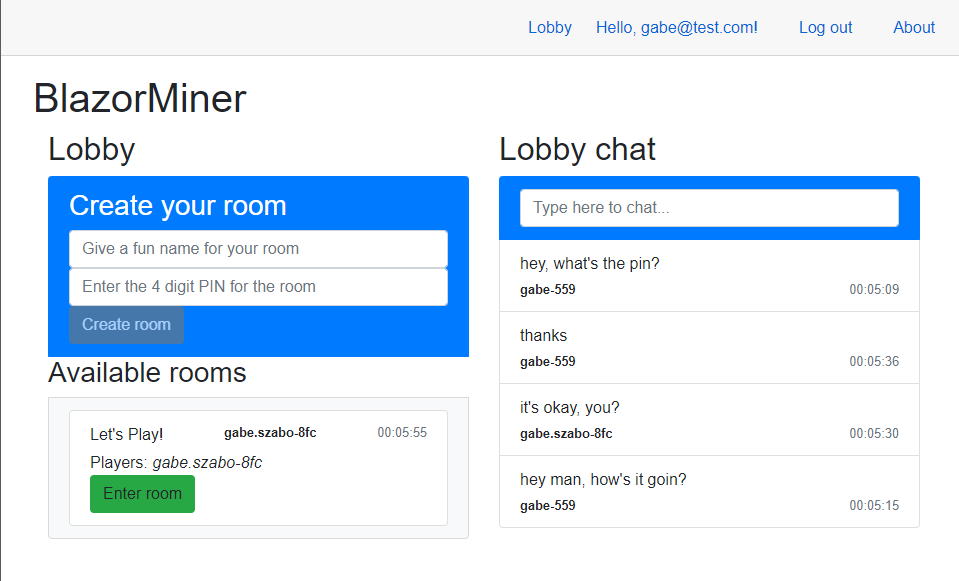
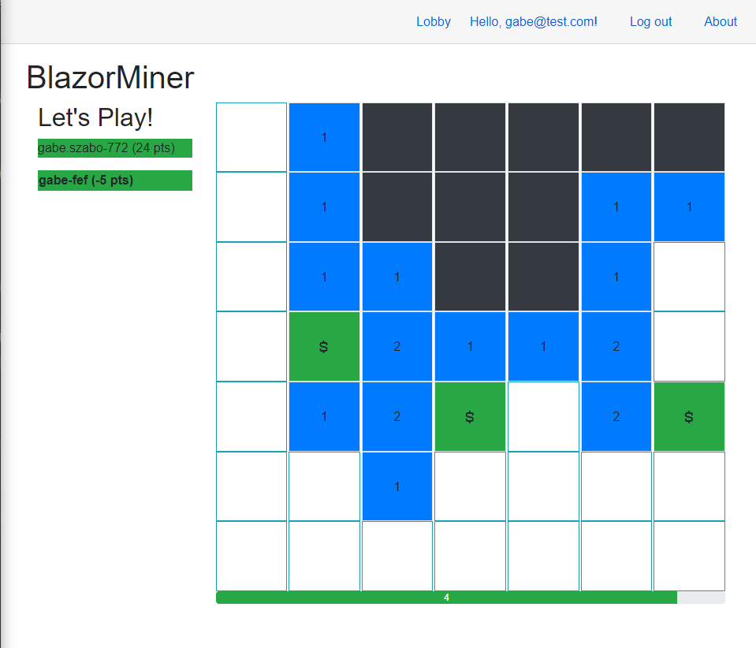
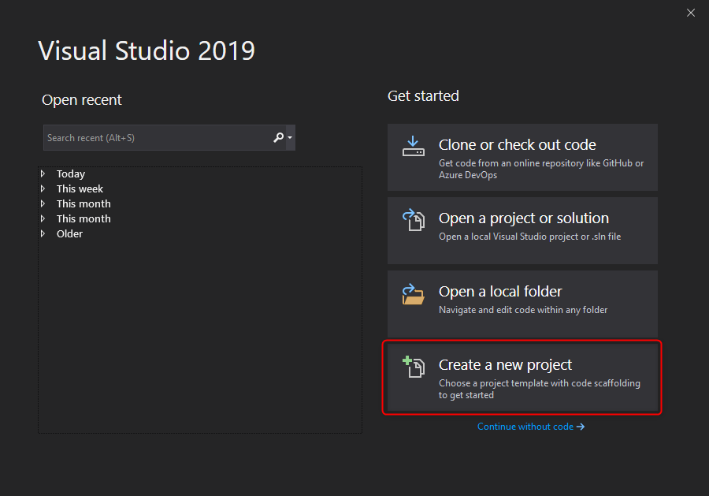
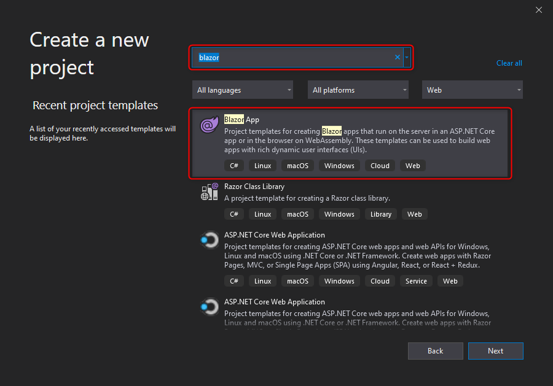
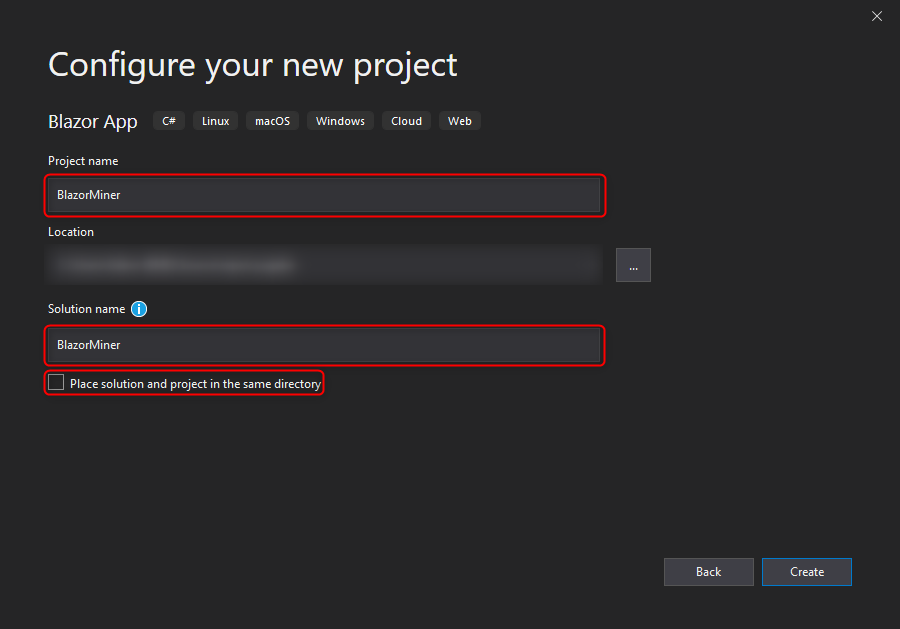
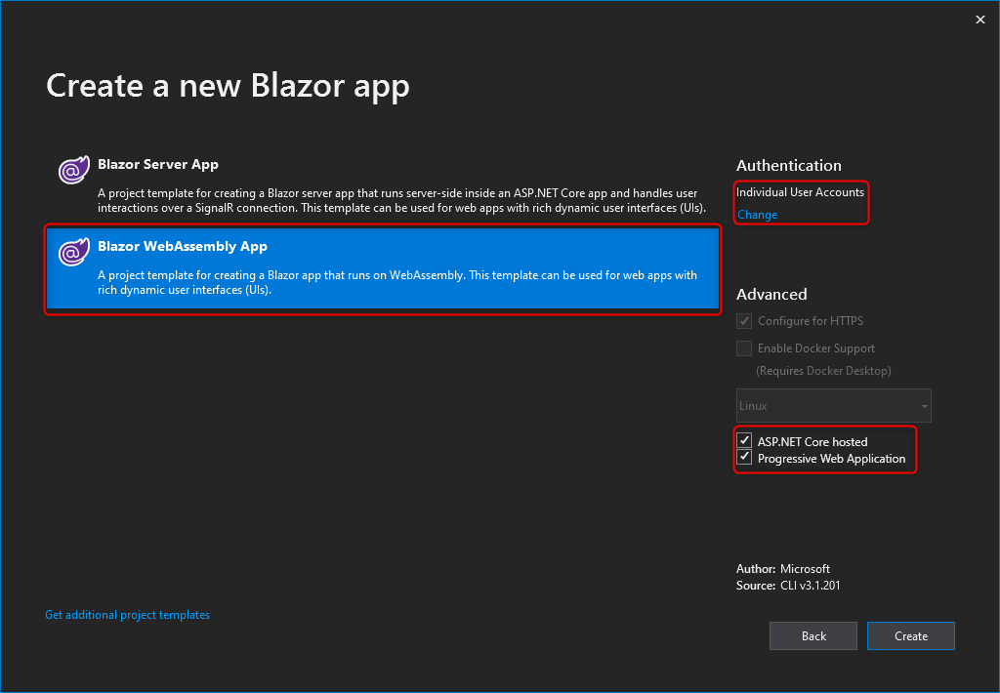
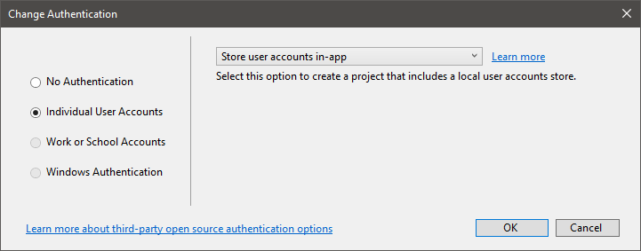
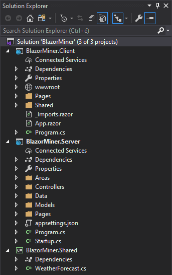
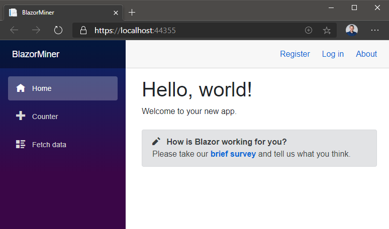
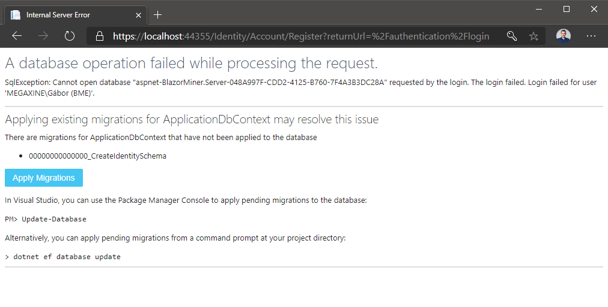

# BlazorMiner

## We are going to create a game that is similar to [Microsoft Minesweeper](https://www.microsoft.com/p/microsoft-minesweeper/9wzdncrfhwcn), but instead of marking and avoiding spots which contain mines, you collect treasure in their place in a multiplayer, turn-based setting.

The project in its completed state is a real-time game that uses [ASP.NET Core](https://docs.microsoft.com/aspnet/core/introduction-to-aspnet-core) frameworks [Blazor WebAssembly](https://docs.microsoft.com/aspnet/core/blazor), [Web API](https://docs.microsoft.com/aspnet/core/web-api), [Identity](https://docs.microsoft.com/aspnet/core/security/authentication), [SignalR](https://docs.microsoft.com/aspnet/core/signalr/introduction) and [Entity Framework Core](https://docs.microsoft.com/ef/core/). All used software are free to use, and all code written is based on open source software mainly made available by Microsoft.

The goal of this project to get an "in-depth, deep-dive overview" of the above frameworks, primarily intended for people who are at least a little familiar with the .NET ecosystem. Unless high demand requires it, not much explanation will be added to the steps required, as the primary documentation by Microsoft is the best place to learn these technologies. This project focuses on dipping your toes into each of these technologies, focusing on the latest and greatest of them all, [Blazor](https://dotnet.microsoft.com/apps/aspnet/web-apps/blazor). At the time of writing, Blazor WebAssembly is in public preview for ASP.NET Core 3.1 (version 3.2.0-rc1.20223.4) with the production ready version coming in the following weeks. The project can be completed at a steady pace in about <b>90-120 minutes</b>. Obviously, the project is not a production ready application, has bugs, anomalies and is rough around the edges, but feel free to [view the current issues](https://github.com/yugabe/BlazorMiner/issues), [open a new issue](https://github.com/yugabe/BlazorMiner/issues/new), fork or send me a pull request if you so desire, as any community interaction is most welcome.

Please, <b>don't forget to Star</b> this repository if you enjoyed its contents or themes; it's free to do so!

This is a step-by-step tutorial to complete this project. The repository contains the completed project, but the tutorial will cover creating the project from scratch to the completed version.






## Starting from the template

1. Prerequisites
   - at least Visual Studio 2019 Community [(free download)](https://visualstudio.microsoft.com/vs/community/) or above, version 16.5.4 or above with the <b>Web development</b> payload enabled,
       - if you are not on Windows, you can still use Visual Studio Code, but the differences won't be reflected in this tutorial,
       - if you would like to be able to debug not only the server but the WebAssembly client too, you have to have at least Visual Studio 2019 16.6 (currently Preview 5),
   - .NET Core SDK version 3.1.201 or above [(free download)](https://dotnet.microsoft.com/download/dotnet-core/3.1),
   - a popular evergreen browser, the new Microsoft Edge is highly recommended [(free download)](https://www.microsoft.com/edge).

2. Install the Blazor WebAssembly template.

Run the following command in a PowerShell window:

``` PowerShell
dotnet new -i Microsoft.AspNetCore.Components.WebAssembly.Templates::3.2.0-rc1.20223.4
```

If you had Visual Studio running, close it after installing the template.

3. Open Visual Studio and Create a new Blazor WebAssembly project with the following settings and steps:
   - Choose "Create a new project" in the startup window.
     
   - Search for "blazor" in the search box and choose the "Blazor App" application type.
     
   - Name the project and solution both "BlazorMiner", uncheck "Place solution and project in the same directory", and select the location in your PC you would like to work in.
     
   - Choose the "Blazor WebAssembly" app template. Check the "ASP.NET Core" hosted and "Progressive Web Application" checkboxes. Do not hit Next yet! If you don't see this template, close Visual Studio and go back to Step 2 and try installing the template again.
     
   - Choose "Individual User Accounts" and "Store user accounts in-app" after clicking "Change" below the "Authentication" block.
     

Once ready, you will see a solution like this with 3 projects:



The 3 projects are as follows:
- BlazorMiner.Client: The Blazor WebAssembly application. This app will be served by our server to the connected browsers, and it will run in the browser via WebAssembly.
- BlazorMiner.Server: The ASP.NET Core server application, which will provide us with the backend functionality via Web API, ASP.NET Core Identity for user management, Entity Framework Core for storing data in a SQL database and which will serve the client application bundle to the browsers.
- BlazorMiner.Shared: This assembly is shared between the client and the server. We'll place model objects here, which will be used by both the client and the server. You should take care when adding any dependencies to this project (like NuGet packages), as it will be included in the client too, and the client package size should be as small as rationally possible. Any classes, data and functionality will be working in both of our applications, but to further drive in the point, for example any static variables will be allocated multiple times: once on the server, and once for every connected browser tab (or iframe).

If we start the project (Start with debugging, or F5), we'll be greeted with this hello world application:



Note that the application uses the default Identity UI, which is based on Razor Pages. Configuring the Identity UI is not covered in this tutorial.

# Create an account

You can go ahead and create your local account.

4. Click on Register.
5. Provide your e-mail address and password. Validation errors will tell you when your password is not strong enough or your e-mail address format is invalid.
6. You'll see the following screen, which tells you that your application's database does not exist. You'll see a similar page when your database schema is not up to date with your Entity Framework model. Click on the button to create the database (using SQL Server LocalDB) on your PC and when the button stops being disabled, refresh the page. As a rule of hand, you should always read through messages like this, as it contains most information that can get you started on how to approach issues like these.



7. Then you'll get notified that there is no e-mail sender configured for the application. This is no problem, as you get a link right in the response you can click to confirm your e-mail address. Obviously, this flow is only valid for development/learning purposes.

8. In the upper-right corner, click on the Login link and use your e-mail address and password to log in to the application.

# Study the initial application

9. Go ahead and try interacting with the application. At the same time, take a look at the application code, starting with the client, but do not forget about the server either. I advise you take a look at all the files in the solution and try to grasp which file does what in the great scenario of server-client computing, including the development-specific parts of the application (like the launchSettings.json file). Depending on how far you dig, this can take up to a minute or hours, maybe even days of your time depending on how experienced you are in the ASP.NET ecosystem and how thorough you are generally, as you might need to study lots of articles on the web if you want to make sense of all files created, so keep this in mind, but try to get a big-picture overview of what's what.

# Clean up the application

10. When you're finished studying the application's codebase, stop the application and delete the following files:
   - BlazorMiner.Client/Pages/Counter.razor
   - BlazorMiner.Client/Pages/FetchData.razor
   - BlazorMiner.Client/Shared/SurveyPrompt.razor
   - BlazorMiner.Server/Controllers/WeatherForecastController.cs
   - BlazorMiner.Shared/WeatherForecast.cs

11. Append the following namespaces to import to the Client's _Imports.razor file:

``` C#
@using Microsoft.AspNetCore.Authorization
@using Microsoft.AspNetCore.Components.WebAssembly.Authentication
@using BlazorMiner.Shared
@using BlazorMiner.Client.Services
@using Microsoft.AspNetCore.SignalR.Client
```

# Chatting in the lobby

We are going to introduce our first feature to the application: rooms. Rooms are going to be representing a session of gameplay for our players. We won't be persisting room data to the database, only keeping them in the server's memory (for simplicity's sake). In the "lobby", the Index page of our game, we'll see the available rooms and a chat box. In the chat box, 10 of the last public text messages will be shown with a timestamp and the user's e-mail address (we don't want to complicate user management, so we won't be using nicknames at the moment).

To create a room a user needs to provide a name for the room and a PIN number consisting of 4 numeric characters.

When a user chooses a room to enter and provides the right PIN number, they are redirected to the page of the game.


12. Add a new data class named `Message` to the Shared project with the following content:

``` C#
using System;

namespace BlazorMiner.Shared
{
    public class Message
    {
        public DateTime Date { get; set; }
        public string User { get; set; }
        public string Text { get; set; }
    }
}

```

13. Add a new interface to the Shared project named `IMinerClient` and one named `IMinerHub`.

``` C#
using System.Threading.Tasks;

namespace BlazorMiner.Shared
{
    public interface IMinerClient
    {
        Task RecieveLobbyMessageAsync(Message message);
    }
}
```

``` C#
using System.Threading.Tasks;

namespace BlazorMiner.Shared
{
    public interface IMinerHub
    {
        Task SendMessageToLobbyAsync(string message);
    }
}
```

14. Add a new folder named Hubs to the Server project, and a C# class to the folder named `MinerHub`.

``` C#
using BlazorMiner.Server.Data;
using BlazorMiner.Shared;
using Microsoft.AspNetCore.Authorization;
using Microsoft.AspNetCore.SignalR;
using System;
using System.Threading.Tasks;

namespace BlazorMiner.Server.Hubs
{
    [Authorize]
    public class MinerHub : Hub<IMinerClient>, IMinerHub
    {
        public MinerHub(ApplicationDbContext applicationDbContext)
        {
            ApplicationDbContext = applicationDbContext;
        }

        public ApplicationDbContext ApplicationDbContext { get; }

        private async Task<string> GetUserNameAsync(string userId = null)
        {
            userId ??= Context.UserIdentifier;
            var email = (await ApplicationDbContext.Users.FindAsync(userId)).Email;
            return $"{email[0..email.IndexOf('@')]}-{userId[0..3]}";
        }

        public async Task SendMessageToLobbyAsync(string message) => 
            await Clients.All.RecieveLobbyMessageAsync(new Message
            {
                Date = DateTime.Now,
                Text = message?.Length > 100 ? message[0..100] : message,
                User = await GetUserNameAsync()
            });
    }
}

```

15. Configure the server's services in the `Startup.ConfigureServices` method to use the SignalR hub we created by adding it to the dependency injection container. We also need to add a little magic that enables the SignalR Hub to authenticate via query string parameter when establishing the WebSocket connection. While we're here, we can also add response compression to the container, which SignalR will use.

``` C#
// using using Microsoft.AspNetCore.Authentication.JwtBearer;

services.PostConfigureAll<JwtBearerOptions>(options =>
{
    var originalOnMessageReceived = options.Events.OnMessageReceived;
    options.Events.OnMessageReceived = async context =>
    {
        await originalOnMessageReceived(context);
        context.Token ??= context.Request.Query["access_token"];
    };
});

services.AddSignalR();

services.AddResponseCompression(opts =>
{
    opts.MimeTypes = ResponseCompressionDefaults.MimeTypes.Concat(
        new[] { "application/octet-stream" });
});
```

16. After adding the appropriate services to the container, we can add an endpoint to our SignalR hub to the middleware pipeline in the `Startup.Configure` method. Take care to insert this <b>before</b> the client fallback path is registered.

``` C#
// using BlazorMiner.Server.Hubs;
endpoints.MapHub<MinerHub>("/minerhub");
```

17. Add the `Microsoft.AspNetCore.SignalR.Client` NuGet package reference with <b>version 3.1.3</b> or higher to the BlazorMiner.Client project.

18. Add a new folder to the Client project named `Services`, and create a new class in this folder named `MinerClient`. 

``` C#
using BlazorMiner.Shared;
using Microsoft.AspNetCore.Components;
using Microsoft.AspNetCore.Components.WebAssembly.Authentication;
using Microsoft.AspNetCore.Http.Connections;
using Microsoft.AspNetCore.SignalR.Client;
using Microsoft.Extensions.DependencyInjection;
using System;
using System.Collections.Generic;
using System.Linq;
using System.Linq.Expressions;
using System.Threading.Tasks;

namespace BlazorMiner.Client.Services
{
    public class MinerClient : IMinerClient
    {
        private HubConnection HubConnection { get; }

        public bool IsConnected => HubConnection?.State == HubConnectionState.Connected;

        public event Action StateHasChanged = () => Console.WriteLine("State changed");

        public MinerClient(HubConnection hubConnection)
        {
            HubConnection = hubConnection;
            foreach (var method in typeof(IMinerClient).GetMethods())
                HubConnection.On(method.Name, method.GetParameters().Select(p => p.ParameterType).ToArray(), parameters =>
                {
                    Console.WriteLine($"Calling {method.Name} with {parameters.Length} parameters.");
                    var result = (Task)method.Invoke(this, parameters);
                    Console.WriteLine($"Called {method.Name} with {parameters.Length} parameters.");
                    StateHasChanged?.Invoke();
                    return result;
                });
        }

        public static async Task<HubConnection> HubConnectionFactory(IServiceProvider serviceProvider)
        {
            using var scope = serviceProvider.CreateScope();
            if (!(await scope.ServiceProvider.GetRequiredService<IAccessTokenProvider>().RequestAccessToken()).TryGetToken(out var token))
                return null;
            var hubConnection = new HubConnectionBuilder().WithUrl(scope.ServiceProvider.GetRequiredService<NavigationManager>().ToAbsoluteUri("/minerhub"), HttpTransportType.WebSockets, o =>
            {
                o.SkipNegotiation = true;
                o.Url = new Uri(o.Url + $"?access_token={token.Value}");
            }).WithAutomaticReconnect(Enumerable.Range(0, 10).Select(i => TimeSpan.FromSeconds(i)).ToArray()).Build();
            await hubConnection.StartAsync();
            return hubConnection;
        }

        public async Task InvokeAsync(Expression<Func<IMinerHub, Task>> sendFunction)
        {
            var methodCallExpression = (MethodCallExpression)sendFunction.Body;
            await HubConnection.InvokeCoreAsync(methodCallExpression.Method.Name, methodCallExpression.Arguments.Select(a => Expression.Lambda(a).Compile().DynamicInvoke()).ToArray());
        }

        public async Task<TResult> InvokeAsync<TResult>(Expression<Func<IMinerHub, Task<TResult>>> sendFunction)
        {
            var methodCallExpression = (MethodCallExpression)sendFunction.Body;
            return await HubConnection.InvokeCoreAsync<TResult>(methodCallExpression.Method.Name, methodCallExpression.Arguments.Select(a => Expression.Lambda(a).Compile().DynamicInvoke()).ToArray());
        }

        public IEnumerable<Message> LobbyMessages => _lobbyMessages;

        private readonly LinkedList<Message> _lobbyMessages = new LinkedList<Message>();

        public Task RecieveLobbyMessageAsync(Message message)
        {
            _lobbyMessages.AddFirst(message);
            if (_lobbyMessages.Count > 10)
                _lobbyMessages.RemoveLast();
            return Task.CompletedTask;
        }
    }
}

```

You can see that the server's and client's interfaces are shared, each one knows of the other, and the interfaces are implemented in the appropriate project: the `MinerClient` in the client, the `MinerHub` in the server. This will let us to use the hubs for static type checking in both applications, avoiding any magic strings (by default, you have to specify the name of the method you have to call as a string on both client and server).

The client side has a few curiosities:
   - In the static factory method the SignalR HubConnection is built asynchronously. We'll use this as a workaround to register a dependency into the container asynchronously. We need to do this because the access token can only be retrieved asynchronously via the IAccessToken service, and the connection can only be established asynchronously. Also, as we need (and want) to register the MinerClient as a singleton dependency, all its dependencies must also be Singletons or Transients. As the IAccessTokenProvider is Scoped, we need to create a scope around our singleton instantiation. We can dispose of it afterwards, because we only need it in the function itself.
   - We are skipping SignalR negotiation, thus saving a round-trip time to the server.
   - The client uses reflection the automagically register all server callbacks to itself via the interface method signatures. It supposes that all methods on the client return with a Task (as opposed to void).
   - The InvokeAsync methods use reflection and expression building to be able to send messages to the server in a typesafe and statically sound manner. They await a lambda expression which has to be in the correct format (directly invoking the parameters method with the appropriate parameters). 

19. Register the MinerClient and the HubConnection factory to the client's dependency injection container in `Program`, replacing the original `await builder.Builder().RunAsync();` line:

``` C#
// using BlazorMiner.Client.Services;
// using Microsoft.AspNetCore.SignalR.Client;

builder.Services.AddSingleton<MinerClient>();
builder.Services.AddSingleton(MinerClient.HubConnectionFactory);
var host = builder.Build();
var hubConnection = await host.Services.GetRequiredService<Task<HubConnection>>();
if (hubConnection != null)
    builder.Services.AddSingleton(hubConnection);
host = builder.Build();
await host.RunAsync();
```

You can see it is registered a bit weirdly. It is because it could (and should) be a singleton instance, but singletons can't have scoped dependencies, which the IAccessTokenProvider is.

20. Create a file called site.js with the following content in the Client's wwwroot folder:

``` JS
function focus(element) {
    element.focus();
}
```

21. Import the script at the bottom of the index.html:

``` HTML
<script src="site.js"></script>
```

22. Change the contents of the Client's Index page in its Pages folder:

``` HTML
@page "/"
@attribute [Authorize]

<h1>BlazorMiner</h1>

<div class="container-fluid">
    <div class="row">
        <div class="col">
            <h2>Lobby</h2>
        </div>
        <div class="col">
            <h2>Lobby chat</h2>
            <div class="list-group">
                <div class="list-group-item bg-primary active">
                    <form @onsubmit="SendChatMessageAsync">
                        <input @ref="ChatInput"
                               class="form-control" 
                               @bind="_chatMessage"
                               autofocus 
                               disabled="@(_chatMessageSending || !MinerClient.IsConnected)" 
                               placeholder="Type here to chat..." />
                        <button type="submit" style="display: none"></button>
                    </form>
                </div>
                @foreach (var item in MinerClient.LobbyMessages)
                {
                    <a class="list-group-item" @key="item">
                        <p class="mb-1">@item.Text</p>
                        <div class="d-flex w-100 justify-content-between">
                            <small class="font-weight-bold">@item.User</small>
                            <small class="text-muted">@item.Date.ToString("HH:MM:ss")</small>
                        </div>
                    </a>
                }
            </div>
        </div>
    </div>
</div>

@code {
    [Inject] MinerClient MinerClient { get; set; }
    [Inject] IJSRuntime JSRuntime { get; set; }
    ElementReference ChatInput { get; set; }
    bool _chatMessageSending = false;
    string _chatMessage = "";

    protected override void OnInitialized()
    {
        MinerClient.StateHasChanged += StateHasChanged;
    }

    async Task SendChatMessageAsync()
    {
        if (string.IsNullOrWhiteSpace(_chatMessage) || _chatMessageSending || !MinerClient.IsConnected)
            return;

        _chatMessageSending = true;
        await MinerClient.InvokeAsync(h => h.SendMessageToLobbyAsync(_chatMessage));
        _chatMessageSending = false;
        _chatMessage = "";
        StateHasChanged();
        await JSRuntime.InvokeVoidAsync("focus", ChatInput);
    }
}

```

A few things to note:
   - The Index page will list the available rooms on the left hand side, the chat panel on the right.
   - The page has an `[Authorize]` attribute, so we'll only be able to view this page if we are signed in.
   - The top of the chat has a input in a form you can enter your chat massage into. This will call the SignalR endpoint `SendMessageToLobbyAsync` with the contents of the input field. Before calling the endpoint and after we recieve the result, we set a variable which states that the sending is in progress. We use this to disable the input in the meantime. After the result is recieved, we empty the input field value and focus on the element via JavaScript interop. We need to call `StateHasChanged()` before focusing, because the element is disabled at the time of call, so we need to refresh the DOM before calling into JavaScript.
   - The component's StateHasChanged method is registered to be called when the MinerClient fires its own StateHasChanged event in when the server replies. This ensures the UI will stay up to date in these cases.
   - We are binding the available messages from the MinerClient's `LobbyMessages` property, which holds up to 10 of the latest chat messages. The new messages will always appear on the top. The server only sends the latest message to all clients, it does not store the messages, so we only see the messages that we recieve after we joined the lobby.
   - We use the `@key` attribute on the iterated elements to differentiate them by reference. This ensures that Blazor won't unintentionally reuse elements (for example when the same message is sent multiple times).

# Creating rooms

23. Create the following symbols that will be shared between the client and the server to create rooms. The files should be named after the symbol (class, enum) defined in the file in the Shared project:

``` C#
namespace BlazorMiner.Shared
{
    public class User
    {
        public string Id { get; set; }
        public string Name { get; set; }
        public int Points { get; set; }
    }
}
```

``` C#
using System;
using System.Collections.Generic;

namespace BlazorMiner.Shared
{
    public class Room
    {
        public Guid Id { get; set; }
        public DateTime Date { get; set; }
        public User Host { get; set; }
        public string Name { get; set; }
        public bool Started { get; set; }
        public List<User> Users { get; set; }
    }
}
```

``` C#
namespace BlazorMiner.Shared
{
    public enum EnterRoomResult
    {
        InvalidRoomId = 1,
        InvalidPin = 2,
        Ok = 3,
        GameAlreadyInProgress = 4,
        UserAlreadyInRoom = 5
    }
}
```

``` C#
using System.Text.RegularExpressions;

namespace BlazorMiner.Shared
{
    public class RoomPinValidator
    {
        public bool IsValidPin(string pin) => pin != null && Regex.IsMatch(pin, @"^\d{4}$");
    }
}
```

As you can see, we will be using a simple class to share logic between the client and the server, not just data objects!

24. Register the PIN validator to both the server's and the client's DI container:

``` C#
//using BlazorMiner.Shared;
services.AddSingleton<RoomPinValidator>();
```

``` C#
//using BlazorMiner.Shared;
builder.Services.AddSingleton<RoomPinValidator>();
```

25. Append a new method to the client's interface and implement it:

``` C#
// using System.Collections.Generic;
Task UpdateRoomsListAsync(List<Room> rooms);
```

``` C#
public IEnumerable<Room> Rooms => _rooms ?? Enumerable.Empty<Room>();

private List<Room> _rooms;

public Task UpdateRoomsListAsync(List<Room> rooms)
{
    _rooms = rooms;
    return Task.CompletedTask;
}
```

26. Implement creating/entering/deleting a room on the server in the MinerHub class:

``` C#
// using System.Collections.Concurrent;
// using System.Collections.Generic;
// using System.Linq;

public MinerHub(ApplicationDbContext applicationDbContext, RoomPinValidator roomPinValidator)
{
    ApplicationDbContext = applicationDbContext;
    RoomPinValidator = roomPinValidator;
}

public RoomPinValidator RoomPinValidator { get; }

// Other previously written properties and methods omitted for brevity.
private static ConcurrentDictionary<Guid, (string Pin, Room Room)> Rooms { get; } = new ConcurrentDictionary<Guid, (string, Room)>();

public Task<string> GetUserIdAsync() => Task.FromResult(Context.UserIdentifier);

public async Task<List<Room>> UpdateRoomsAsync()
{
    foreach (var (id, _) in Rooms.Where(r => r.Value.Room.Date < DateTime.Today.AddHours(-1)).ToList())
        Rooms.Remove(id, out _);
    var rooms = Rooms.Select(r => r.Value.Room).OrderBy(r => r.Date).ToList();
    await Clients.All.UpdateRoomsListAsync(rooms);
    return rooms;
}

private async Task<User> GetCurrentUserAsync() =>
    new User
    {
        Id = Context.UserIdentifier,
        Name = await GetUserNameAsync()
    };

public async Task<Room> CreateRoomAsync(string pin, string name)
{
    if (!RoomPinValidator.IsValidPin(pin))
        throw new HubException("Invalid PIN.");

    var user = await GetCurrentUserAsync();
    var room = new Room
    {
        Date = DateTime.Now,
        Id = Guid.NewGuid(),
        Name = name,
        Started = false,
        Host = user,
        Users = new List<User> { user }
    };
    Rooms.TryAdd(room.Id, (pin, room));
    await UpdateRoomsAsync();
    return room;
}

public async Task DeleteRoomAsync(Guid roomId)
{
    if (Rooms.TryGetValue(roomId, out var item) && item.Room.Host?.Id == Context.UserIdentifier)
        Rooms.Remove(roomId, out _);
    await UpdateRoomsAsync();
}

public async Task<EnterRoomResult> EnterRoomAsync(Guid roomId, string pin)
{
    var check = (RoomExists: Rooms.TryGetValue(roomId, out var item),
                 PinIsCorrect: item.Pin == pin,
                 UserIsInRoom: item.Room?.Users.Any(u => u.Id == Context.UserIdentifier),
                 GameInProgress: item.Room?.Started == true);
    var result = check switch
    {
        (true, true, false, false) => EnterRoomResult.Ok,
        (true, true, false, true) => EnterRoomResult.GameAlreadyInProgress,
        (true, true, true, _) => EnterRoomResult.UserAlreadyInRoom,
        (true, false, _, _) => EnterRoomResult.InvalidPin,
        (false, _, _, _) => EnterRoomResult.InvalidRoomId,
    };
    if (result == EnterRoomResult.Ok)
    {
        item.Room.Users.Add(await GetCurrentUserAsync());
        await UpdateRoomsAsync();
    }
    return result;
}

```

Aw, pattern matching switch expressions, how convenient.

27. Pull up the new methods to the interface:

``` C#
// using System;
// using System.Collection.Generic;
Task<EnterRoomResult> EnterRoomAsync(Guid roomId, string pin);
Task<Room> CreateRoomAsync(string pin, string name);
Task DeleteRoomAsync(Guid roomId);
Task<List<Room>> UpdateRoomsAsync();
Task<string> GetUserIdAsync();
```

27. Implement creating a room and entering a room on the client by choosing from the list and supplying a valid, 4-digit PIN code. In the Index.razor file, also don't forget to change OnInitialized to OnInitializedAsync as seen before, so the clients are always up to date on the states of the rooms, even when starting the application.

``` HTML
<h2>Lobby</h2>
<div class="list-group">
    <div class="list-group-item bg-primary active">
        <h3>Create your room</h3>
        <form @onsubmit="CreateRoomAsync">
            <input class="form-control"
                    @bind="NewRoomName"
                    @bind:event="oninput"
                    disabled="@(_creatingRoom || !MinerClient.IsConnected)"
                    placeholder="Give a fun name for your room" />
            <input class="form-control"
                    @bind="NewRoomPin"
                    @bind:event="oninput"
                    disabled="@(_creatingRoom || !MinerClient.IsConnected)"
                    placeholder="Enter the 4 digit PIN for the room" />

            <button class="btn btn-secondary" type="submit" disabled="@(!RoomPinValidator.IsValidPin(NewRoomPin) || string.IsNullOrWhiteSpace(NewRoomName) || !MinerClient.IsConnected)">Create room</button>
        </form>
    </div>
    <h3>Available rooms</h3>
    <div class="list-group-item bg-light">
        @if (MinerClient.Rooms.Any())
        {
            foreach (var room in MinerClient.Rooms)
            {
                <div class="list-group-item" @key="room.Id">
                    <div class="d-flex w-100 justify-content-between">
                        <p class="mb-1 @(room.Started ? "text-dark" : null)">
                            @room.Name
                            @if (room.Users.Any(u => u.Id == _userId))
                            {
                                <a href="/game/@room.Id"><i class="oi oi-arrow-right"></i></a>
                            }
                        </p>
                        <small class="font-weight-bold">@room.Host.Name</small>
                        <small class="text-muted">@room.Date.ToString("HH:MM:ss")</small>
                    </div>
                    <div>
                        Players:
                        @foreach (var (user, index) in room.Users.Select((u, i) => (u, i)))
                        {
                            <i>@user.Name</i>
                            @if (index != room.Users.Count - 1)
                            {<text>, </text>}
                        }
                    </div>
                    @if (_selectedRoom == room)
                    {
                        <form @onsubmit="() => EnterRoomAsync(room)">
                            <input class="form-control"
                                    @bind="EnterRoomPin"
                                    @bind:event="oninput"
                                    disabled="@(_enteringRoom || !MinerClient.IsConnected)"
                                    placeholder="Enter the 4 digit PIN for the room to enter" />
                            <button class="btn btn-secondary" type="submit" disabled="@(!RoomPinValidator.IsValidPin(EnterRoomPin) || _enteringRoom || !MinerClient.IsConnected)">Enter room</button>
                            @if (_enterRoomError != null)
                            {
                                <p class="text-danger small">@_enterRoomError <b style="cursor: pointer" @onclick="() => _enterRoomError = null">X</b></p>
                            }
                        </form>
                    }
                    else if (!room.Started && room.Users.All(u => u.Id != _userId))
                    {
                        <a class="btn btn-success" @onclick="() => { _selectedRoom = room; _enterRoomError = null; }">Enter room</a>
                    }
                </div>
            }
        }
        else
        {
            <h3>No rooms yet :'(</h3>
            <p>Create one above!</p>
        }
    </div>
</div>
```

``` C#

// Other previously written properties, methods and fields omitted for brevity.

protected override async Task OnInitializedAsync()
{
    MinerClient.StateHasChanged += StateHasChanged;
    await MinerClient.InvokeAsync(h => h.UpdateRoomsAsync());
    _userId = await MinerClient.InvokeAsync(h => h.GetUserIdAsync());
}

[Inject] RoomPinValidator RoomPinValidator { get; set; }

string _userId;
string NewRoomName { get; set; }

string _newRoomPin;
string NewRoomPin
{
    get => _newRoomPin;
    set => _newRoomPin = (value == null || (value.Length <= 4 && value.All(c => int.TryParse(c.ToString(), out _)))) ? value : _newRoomPin;
}

bool _creatingRoom = false;

[Inject] NavigationManager NavigationManager { get; set; }

async Task CreateRoomAsync()
{
    if (!RoomPinValidator.IsValidPin(NewRoomPin) || string.IsNullOrWhiteSpace(NewRoomName) || !MinerClient.IsConnected)
        return;

    _creatingRoom = true;
    try
    {
        var room = await MinerClient.InvokeAsync(h => h.CreateRoomAsync(NewRoomPin, NewRoomName));
        NavigationManager.NavigateTo($"/game/{room.Id}");
    }
    finally
    {
        _creatingRoom = false;
    }
}

bool _enteringRoom = false;
Room _selectedRoom;

string _enterRoomPin;
string EnterRoomPin
{
    get => _enterRoomPin;
    set => _enterRoomPin = (value == null || (value.Length <= 4 && value.All(c => int.TryParse(c.ToString(), out _)))) ? value : _enterRoomPin;
}

string _enterRoomError;

async Task EnterRoomAsync(Room room)
{
    if (room == null || !RoomPinValidator.IsValidPin(EnterRoomPin) || _enteringRoom || !MinerClient.IsConnected)
        return;

    _enteringRoom = true;
    var result = await MinerClient.InvokeAsync(h => h.EnterRoomAsync(room.Id, EnterRoomPin));
    _enterRoomError = result switch
    {
        EnterRoomResult.InvalidRoomId => "Invalid room ID.",
        EnterRoomResult.InvalidPin => "Invalid PIN.",
        EnterRoomResult.GameAlreadyInProgress => "The game is already in progress",
        _ => null
    };
    if (result == EnterRoomResult.UserAlreadyInRoom || result == EnterRoomResult.Ok)
        NavigationManager.NavigateTo($"/game/{room.Id}");

    _enteringRoom = false;
    _enterRoomPin = "";
}

```

Quite a few things to note here:
   - It would make sense to create a component handling the input of PIN numbers.
   - Naming is hard. Some prefix private fields with an underscore, some don't. Also, the template itself uses PascalCasing for injected fields, which, by convention is used for properties.
   - Error handling/validation could get its own service, maybe even some shared functionality.
   - The server stores the list of rooms in memory, in a static dictionary. This is for simplicity only in this example. Always use proper separation of concerns, in this case an injected dependent class would be better, because it wouldn't be as tightly coupled. More coding though.
   - The state machine for entering a room is distributed between the server and the given client.
   - We use the `@key` attribute again to identify rooms now not by their reference, but their ID. This is useful, because the list of rooms will be overwritten from the server (by reference), but the UI elements will stay in the DOM and won't create/move/delete DOM elements by accident. Also, this way we can keep the focus in an input even if the server responds with a new list of rooms and the DOM refreshes.

We get a NotFound component result when navigating to the given URL (when creating or entering the room). We're going to fix this now.

# The game

28. Delete the sidebar navigation component (NavMenu) and its reference (and container div element) from MainLayout, we won't be needing it at this time. Above the LoginDisplay component, insert a link to the lobby:

``` HTML
<a href="/">Lobby</a>
```

29. Create the model object we'll use to transmit the game's state in the Shared project:

``` C#
using System;
using System.Collections.Generic;

namespace BlazorMiner.Shared
{
    public class GameState
    {
        public Guid GameId { get; set; }
        public string CurrentUserId { get; set; }
        public DateTime? TurnEnds { get; set; }
        public int Size { get; set; }
        public int?[] Map { get; set; }
        public List<User> Users { get; set; }
    }
}
```

30. Now let's update the client, so it knows what to do with this state object. We're going to pass a value representing how many milliseconds remain until the current player's turn will end.

``` C#
Task UpdateGameStateAsync(GameState gameState, double? turnEndsInMilliseconds);
```

``` C#
public event Action<GameState, TimeSpan?> GameStateChanged;
public Task UpdateGameStateAsync(GameState gameState, double? turnEndsInMilliseconds)
{
    GameStateChanged?.Invoke(gameState, turnEndsInMilliseconds == null ? (TimeSpan?)null : TimeSpan.FromMilliseconds(turnEndsInMilliseconds.Value));
    return Task.CompletedTask;
}
```

We're using a different pattern here, the components will be able to subscribe to this event, and the MinerClient instance does not have to hold all the game states it recieves.

31. Implement starting a game, making a move and sending the game state for people in the room on the server:

``` C#
private static ConcurrentDictionary<Guid, (GameState state, Dictionary<(int x, int y), int> map)> Games { get; } = new ConcurrentDictionary<Guid, (GameState game, Dictionary<(int x, int y), int> map)>();

public async Task UpdateGameStateAsync(Guid roomId)
{
    if (Rooms.TryGetValue(roomId, out var item) && Games.TryGetValue(roomId, out var game))
        await Clients.Users(item.Room.Users.Select(u => u.Id).ToList()).UpdateGameStateAsync(game.state, game.state.TurnEnds.HasValue ? (game.state.TurnEnds.Value - DateTime.Now).TotalMilliseconds : (double?)null);
}

private IEnumerable<(int x, int y)> GetNeighbors(Dictionary<(int x, int y), int> map, int x, int y) =>
    new[] {
        (x - 1, y - 1), (x, y - 1), (x + 1, y - 1),
        (x - 1, y), (x + 1, y),
        (x - 1, y + 1), (x, y + 1), (x + 1, y + 1)
    }.Where(map.ContainsKey);

private void NextPlayer(GameState state)
{
    state.CurrentUserId = state.Users[(state.Users.FindIndex(u => u.Id == state.CurrentUserId) + 1) % state.Users.Count].Id;
    state.TurnEnds = DateTime.Now.AddSeconds(5);
}

public async Task StartGameAsync(Guid roomId)
{
    User user = null;
    if (Rooms.TryGetValue(roomId, out var item) && !item.Room.Started && (user = item.Room.Users.FirstOrDefault(u => u.Id == Context.UserIdentifier)) != null)
    {
        item.Room.Started = true;
        var random = new Random();
        var state = new GameState
        {
            GameId = roomId,
            TurnEnds = DateTime.Now.AddSeconds(30),
            CurrentUserId = item.Room.Users.OrderBy(_ => random.Next()).First().Id,
            Size = Math.Min(Math.Max(7, item.Room.Users.Count), 12),
            Users = item.Room.Users.Select(u => new User { Id = u.Id, Name = u.Name, Points = 0 }).ToList()
        };
        user = state.Users.First(u => u.Id == Context.UserIdentifier);
        var map = Enumerable.Range(1, state.Size).SelectMany(x => Enumerable.Range(1, state.Size).Select(y => (x, y))).ToDictionary(c => c, _ => 0);
        state.Map = new int?[state.Size * state.Size];
        foreach (var ((x, y), v) in map.OrderBy(_ => random.Next()).Take((int)(0.15 * state.Size * state.Size)).ToList())
        {
            map[(x, y)] = -1;
            foreach (var neighbor in GetNeighbors(map, x, y))
            {
                if (map[neighbor] != -1)
                    map[neighbor] += 1;
            }
        }

        Games.TryAdd(roomId, (state, map));
        _ = Task.Run(async () =>
        {
            while (state.TurnEnds != null)
            {
                await Task.Delay(500);
                if (state.TurnEnds < DateTime.Now)
                {
                    user.Points -= 10;
                    NextPlayer(state);
                }
                await UpdateGameStateAsync(roomId);
            }
        });
    }
    await UpdateGameStateAsync(roomId);
}

private int GetCoordinate(int x, int y, int size) => size * (y - 1) + (x - 1);

public async Task MakeMoveAsync(Guid roomId, int x, int y)
{
    User user = null;
    int coordinate;
    if (Games.TryGetValue(roomId, out var game) &&
        x > 0 && y > 0 && (coordinate = GetCoordinate(x, y, game.state.Size)) < game.state.Map.Length &&
        game.state.Map[coordinate] == null &&
        (user = game.state.Users.FirstOrDefault(u => u.Id == Context.UserIdentifier)) != null &&
        game.map.TryGetValue((x, y), out var value) &&
        game.state.CurrentUserId == Context.UserIdentifier)
    {
        game.state.Map[coordinate] = value;
        switch (value)
        {
            case -1:
                user.Points += 10;
                break;
            case 0:
                RevealNeighbors(x, y);
                void RevealNeighbors(int x, int y)
                {
                    foreach (var neighbor in GetNeighbors(game.map, x, y).Where(n => game.state.Map[GetCoordinate(n.x, n.y, game.state.Size)] == null))
                    {
                        if ((game.state.Map[GetCoordinate(neighbor.x, neighbor.y, game.state.Size)] = game.map[neighbor]) == 0)
                            RevealNeighbors(neighbor.x, neighbor.y);
                    }
                }
                break;
            case 1:
            case 2:
            case 3:
            case 4:
            case 5:
            case 6:
                user.Points += value;
                break;
        }

        NextPlayer(game.state);
        if (game.state.Map.Count(m => m == -1) == game.map.Count(m => m.Value == -1))
        {
            game.state.Map = game.map.OrderBy(kv => kv.Key.y).ThenBy(kv => kv.Key.x).Select(kv => (int?)kv.Value).ToArray();
            game.state.TurnEnds = null;
            await UpdateGameStateAsync(roomId);
            Games.Remove(roomId, out _);
            Rooms.Remove(roomId, out _);
            await UpdateRoomsAsync();
        }
        else
        {
            game.state.TurnEnds = DateTime.Now.AddSeconds(5);
            await UpdateGameStateAsync(roomId);
        }
    }
}
```

Yes, this here is hardcore MineSweeper logic in C#. 
   - On creating the game a new map is created by the above algorithm. 
   - Users have 5 seconds in their turn, the starting user is going to be random. The first turn is 30 seconds, so everyone can warm up.
   - The field is going to be between 7x7 and 12x12 in size.
   - Every successful start of the game starts another thread, which checks the game state every fewhundred milliseconds and updates the clients and game state accordingly.
   - The goal of the game is to find the mines, here represented as treasures (a dollar sign). Each treasure is worth 10 points. If you click on a tile which has no adjacent mine, the surrounding area is revealed. If you reveal a numbered tile, you get points equal to the number on the tile.

32. Pull up the new methods to the interface:

``` C#
Task UpdateGameStateAsync(Guid roomId);
Task StartGameAsync(Guid roomId);
Task MakeMoveAsync(Guid roomId, int x, int y);
```

33. Implement rendering the UI of the game on the client in a new page called Game:

``` HTML
@page "/game/{gameId}"
@attribute [Authorize]

<h1>BlazorMiner</h1>

@if (!_loaded)
{
    <text><h3>Just a moment...</h3></text>
}
else if (_state != null)
{
    if (_state.TurnEnds != null)
    {
        <div class="container-fluid">
            <div class="row">
                <div class="col-sm-3">
                    <h2>@Room.Name</h2>

                    @foreach (var user in _state.Users)
                    {
                        <p @key="user.Id" class="@(_state.CurrentUserId == user.Id? "text-active font-weight-bold border border-success" : "border-info") @(_userId == _state.CurrentUserId ? "bg-success" : null)">@user.Name (@user.Points pts)</p>
                    }
                    <br />
                </div>
                <div class="col-sm-9 text-center">
                    @for (var y = 1; y <= _state.Size; y++)
                    {
                        <div class="d-flex w-100 justify-content-between">
                            @for (var x = 1; x <= _state.Size; x++)
                            {
                                var value = _state.Map[(y - 1) * _state.Size + (x - 1)];
                                var (xIn, yIn) = (x, y);
                                var sizeInPercent = (int)((double)100 / _state.Size);
                                <div style="display:inline-block; width: @sizeInPercent%; height: @(0.66 * sizeInPercent)vh; line-height: @(0.66 * sizeInPercent)vh;
                                 @(_state.CurrentUserId == _userId && value == null ? "cursor: pointer" : null)
                                 "
                                     @onclick="() => MakeMoveAsync(xIn, yIn)"
                                     class="border @(value == null ? "border-info" : value == -1 ? "bg-success" : value == 0 ? "bg-dark" : "bg-primary")"
                                     disabled="@(_state.CurrentUserId != _userId || value != null)">
                                    @if (value > 0)
                                    {
                                        <text>@value</text>
                                    }
                                    else if (value == -1)
                                    {
                                        <i class="oi oi-dollar"></i>
                                    }
                                    else
                                    {
                                        <text>&nbsp;</text>
                                    }
                                </div>
                            }
                        </div>
                    }
                    @if (_turnEndsIn != null)
                    {
                        <div class="progress">
                            <div class="progress-bar @(_userId == _state.CurrentUserId ? "bg-success" : null)" style="width: @($"{Math.Min(100, _turnEndsIn.Value.TotalMilliseconds / 50)}%")">@((int)_turnEndsIn.Value.TotalSeconds)</div>
                        </div>
                    }
                </div>
            </div>
        </div>
    }
    else
    {
        <div class="text-center">
            @foreach (var (user, index) in _state.Users.OrderByDescending(u => u.Points).Select((u, i) => (u, i)))
            {
                if (index == 0)
                {
                    <h4 class="p-3 text-success border border-dark">#1: <b>@user.Name</b> <small>(@user.Points pts)</small></h4>
                }
                else
                {
                    <p class="p-3 text-muted bg-light @(_userId == user.Id ? "border border-info" : null)">#@(index + 1): <b>@user.Name</b> <small>(@user.Points pts)</small></p>
                }

            }
        </div>
    }
}
else if (Room?.Users != null)
{
    <h3>Hi guys!</h3>
    <ul>
        @foreach (var user in Room.Users)
        {
            <li>@user.Name</li>
        }
    </ul>
    <h5>Can we start?</h5>
    <button class="btn btn-outline-success" @onclick="StartAsync">Yes!</button>
}

@code {
    [Inject] MinerClient MinerClient { get; set; }
    [Inject] NavigationManager NavigationManager { get; set; }
    [Parameter] public string GameId { set => _gameId = Guid.TryParse(value, out var result) ? result : default; }
    Guid _gameId;

    int MaxPoints => _state.Users.Max(p => p.Points);
    GameState _state;
    TimeSpan? _turnEndsIn;
    string _userId;
    bool _loaded = false;

    Room Room => MinerClient?.Rooms?.FirstOrDefault(r => r.Id == _gameId);

    protected override async Task OnInitializedAsync()
    {
        _userId = await MinerClient.InvokeAsync(h => h.GetUserIdAsync());
        MinerClient.StateHasChanged += StateHasChanged;
        MinerClient.GameStateChanged += (newState, turnEndsIn) =>
        {
            if (newState.GameId == _gameId)
            {
                _state = newState;
                _turnEndsIn = turnEndsIn;
                StateHasChanged();
            }
        };
    }

    protected override async Task OnParametersSetAsync()
    {
        await MinerClient.InvokeAsync(h => h.UpdateRoomsAsync());
        if (Room == null)
            NavigationManager.NavigateTo("/");
        else
        {
            await MinerClient.InvokeAsync(h => h.UpdateGameStateAsync(_gameId));
            _loaded = true;
        }
    }

    async Task StartAsync()
    {
        await MinerClient.InvokeAsync(h => h.StartGameAsync(_gameId));
    }

    async Task MakeMoveAsync(int x, int y)
    {
        await MinerClient.InvokeAsync(h => h.MakeMoveAsync(_gameId, x, y));
    }
}

```

Well, not too shabby, eh? What's most impressive is that this works flawlessly on my phone, even through Wi-Fi!

So the key takeaways here:
   - Sometimes SignalR makes things harder than they should be. I had some problems using InvokeCoreAsync, and it seemed that it did not wait for the server to finish the request. Also, I had to make my own "typed" server calls, no idea why doesn't the client support this in some way, or if it does, I didn't find anything about it.
   - It is quite easy to embed data binding into the HTML using Blazor. Most of the time I didn't even have to think, just write the magic @ symbol and bind away!
   - I wanted to show something fun when trying Blazor, but this here is obviously not production ready code. I would seriously consider using Blazor in production however.
   - The most obvious ways for future refactoring is to consider every small part of the view to be their own components. That way, reusability is maximized, and code duplication is probably minimized. It takes a lot more effort though.

# Closing

I hope you liked this tutorial as much as I liked writing it. I am seriously impressed at how great a framework Blazor is. Don't forget: a framework is not good because everyone uses it. It's good because it's good. The community, support, developer experience, documentation... it's all in the pudding.

Please, don't forget to Star this repository if you enjoyed its contents or themes. Thank you for reading! 

<b>Keep on Blazin'!</b>